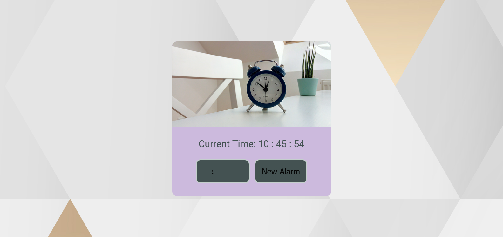

# Alarm Clock

[Live](https://alarm-clock-vanilla-js.netlify.app/)

## Technologies

- JavaScript
- HTML5
- CSS
- Vite

### The challenge

- structuring & Designing the page
- take an input from user to set time for alarm
- use Date object
- play a sound when the the user’s time is over

### What I have learned was how to:

- use Date object
- use Audio object
- work with Vite
- check and run any condition continuously on the website using
